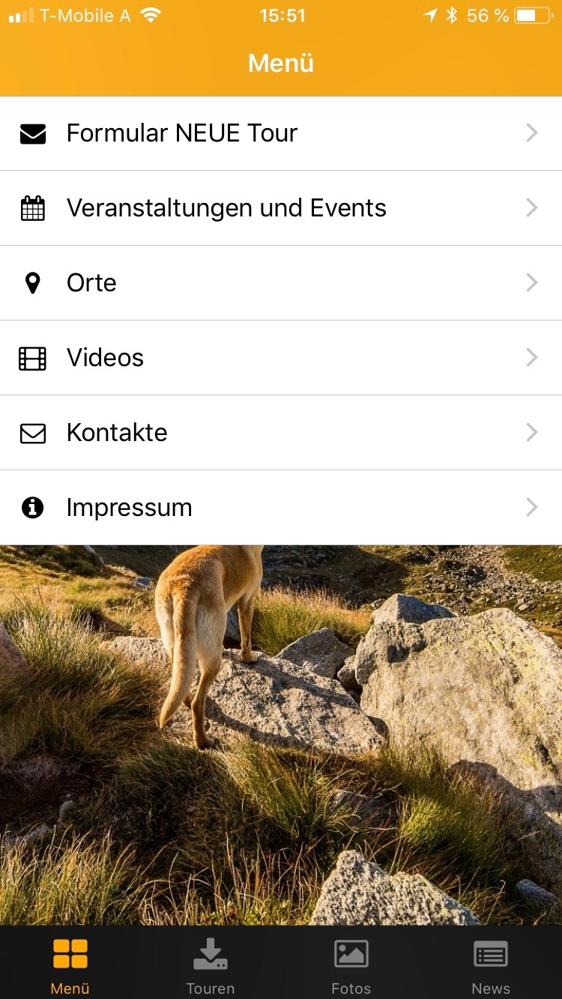
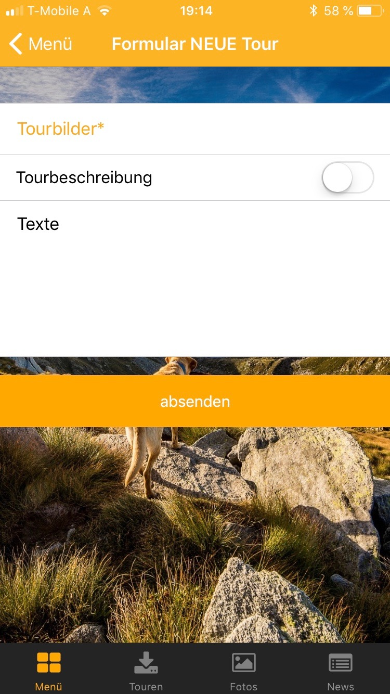
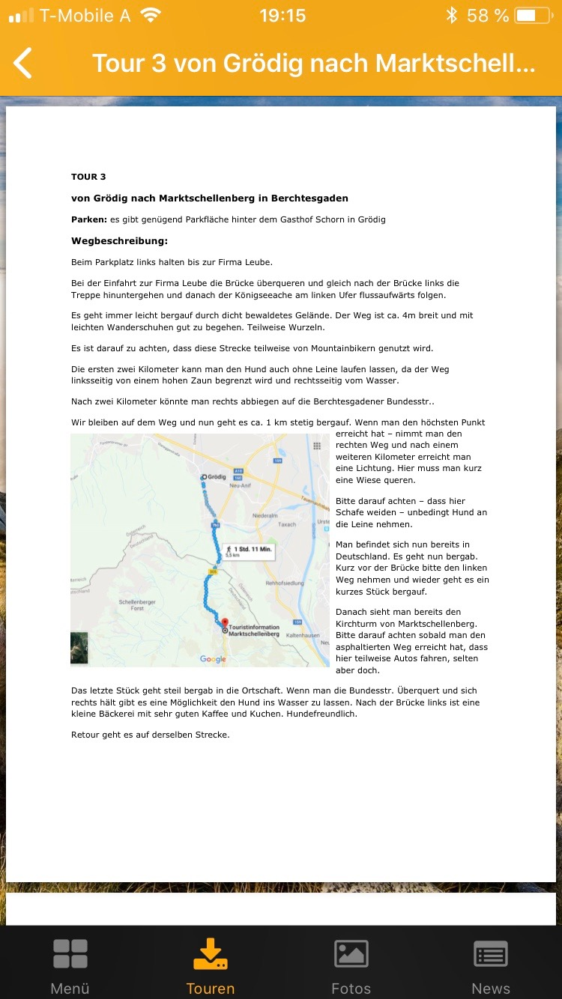
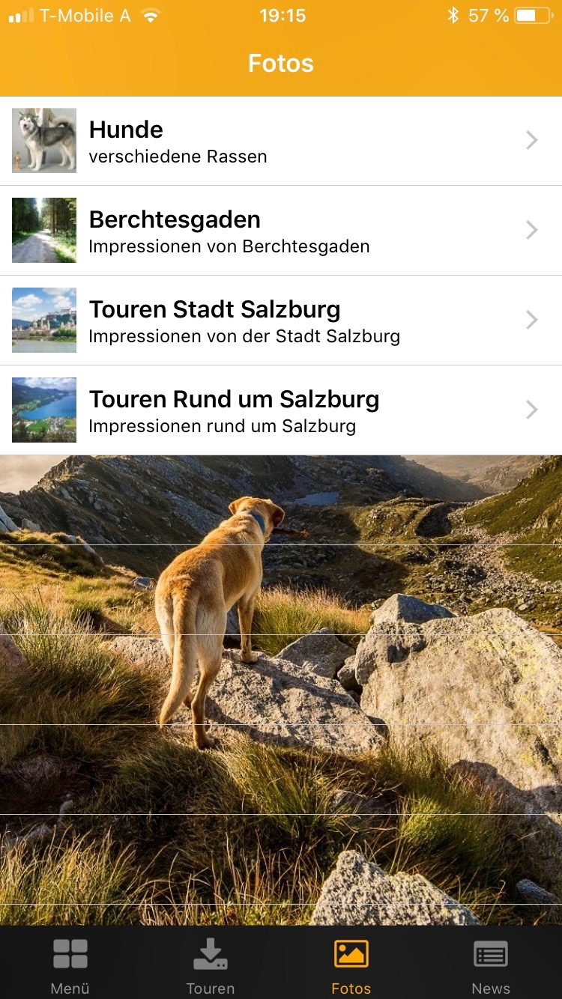
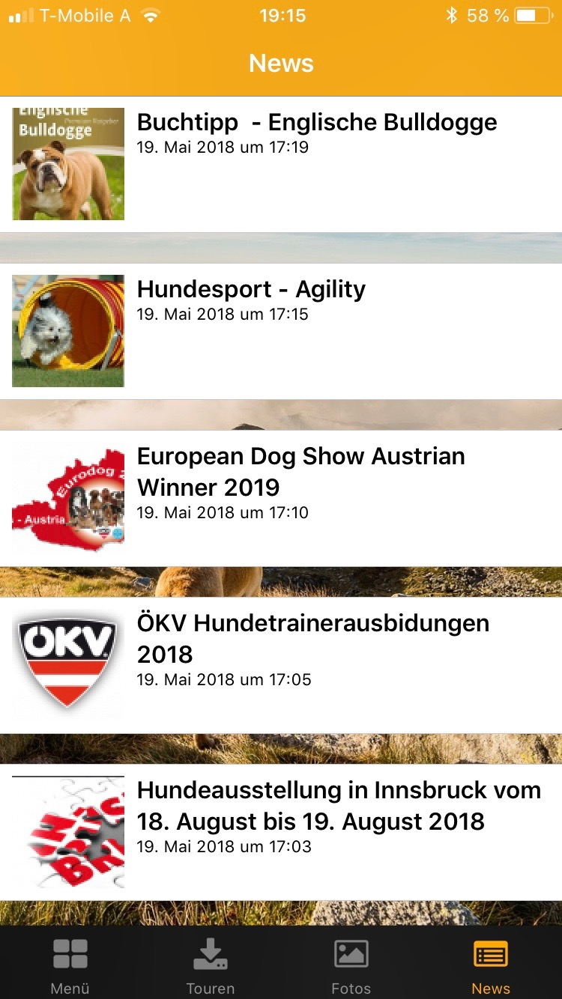

## Was ist dog on tour?

Dog on tour ist eine App und eine Web-Applikation die als Informationsportal rund um den Hund dient. Im Vordergrund sollen gemeinsame Aktivitäten in der freien Natur gemeinsam mit dem Hund stehen.
Diese Aktivitäten werden im Portal als Touren bezeichnet. Die Touren können Spaziergänge, Wanderungen, usw. beinhalten. Weiters können Informationen zu Hundefreilaufplätzen, Leinenpflicht, hundefreundliche Betriebe, Veranstaltungen erfasst und abgefragt werden.
Zum Start der Plattform wird die Stadt Salzburg und Umgebung und der Raum Berchtesgaden dienen.

## Installation

Die App kann über den Store (App Store, Google Play Store) am Handy oder Tablet installier werden. Für die Web-Applikation ist keine Installation erforderlich. Diese kann über die URL [https://mrangger.github.io/](https://mrangger.github.io/) aufgerufen werden.

## Technische Umsetzung - App

Aus Zeit- und Ressourcengründen wurde die App mittels App-Baukasten ?appTitan? entwickelt. 

## Technische Umsetzung - Web-Applikation

Die Web-Applikation wurde in HTML 5 entwickelt. Somit ist es möglich, dass die Webseite auf jedem Endgerät (PC, Handy, Tablet, ...) verwendet werden kann.

## Funktionen - App

- Formular: Neue Touren können direkt im App erfasst werden und somit allen Nutzern zur Verfügung gestellt werden.
- Touren als pdf: Die Touren können auch als pdf-Datei hochgeladen werden.
- Bildergalerie: Es stehen Bildergalerien zum Thema Hundearten, Veranstaltungen, Produkte, etc. zur Verfügung. Es können zu den verschiedensten Themen eigene Alben angelegt werden.
- News: Nutzer immer auf den Laufenden halten durch Eingabe von Nachrichtenbeiträgen.
- Veranstaltungen und Events: Veranstaltungen pflegen und die Nutzer darüber informieren.
- YouTube Videos: Videos über z.B. nützliche Hundetipps können jederzeit aus der App abgespielt werden.
- Orte: Anfahrten zu hinterlegten Orten können direkt aus der App gestartet werden.

## Funktionen - Web-Applikation

- Neue Tour: Erfassen einer neuen Tour direkt beim Spaziergang. Hierbei werden auch die GPS-Daten des Nutzers gespeichert und somit die Route direkt gespeichert.
- Touren: Bereits angelegte Touren werden mittels GoogleMap graphisch angezeigt. 
- Veranstaltungen und Events: Aktuelle Veranstaltungen und Events werden vom Administrator eingepflegt und stehen den Nutzern zur Verfügung.
- Kontakte: Kontaktdaten für Fragen rund um den Service dog on tour.
- Impressum

## Screenshots der App

## Pilotphase

Während der Pilotphase werden die Funktionalitäten der App und der Web-Applikation separat getestet. Somit werden die erfassten Informationen, welche in die App eingegeben werden, noch nicht in der Web-Applikation zur Verfügung stehen.

## Cloud-Dienste

Für die Umsetzung werden folgende Cloud-Dienste verwendet:
- Google Maps: Hier werden die Touren der Web-Applikation angezeigt. Die Ortung des Benutzers, zum Erkennen des aktuellen Standorts, kommt hier auch zum Einsatz.
- Github: Entwicklungsplattform zur Quellcodeverwaltung.
- AppTitan: Baukastensystem zum Entwickeln der App.

## Ausblick

Folgende Funktionen sollen nach der ersten Testphase erweitert werden:
- Die Web-Applikation soll um eine Chatfunktion erweitert werden. Somit kann eine schnelle Kommunikation unter den Nutzern erfolgen.
- Zum Austausch von Informationen soll in Zukunft auch ein Forum auf der Web-Applikation zur Verfügung stehen.

